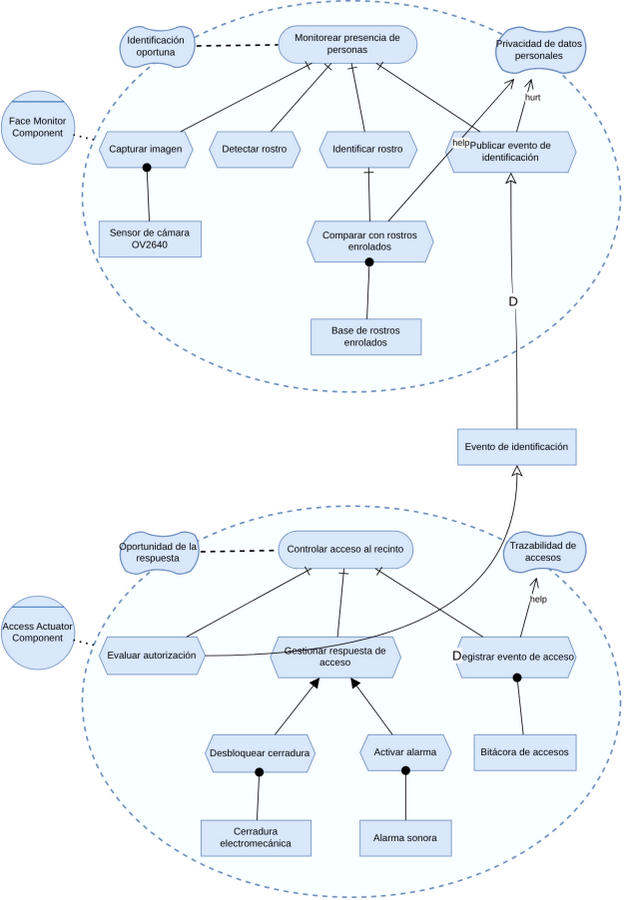
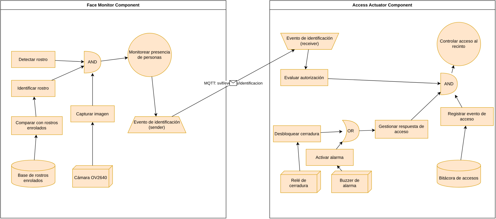

<!--
  NOTA DE MANTENIMIENTO — semana-4
  Esta es la fuente MARP (10 slides), optimizada para exportar a PDF/PPTX.
  La versión enriquecida (HTML+CSS, mismo contenido) vive en
  slides/semana-4/presentacion.html y se usa para impartir.
  Si editas contenido, replica el cambio en AMBOS archivos.
-->

<!-- Exportable a PDF/PPTX con Marp: `marp presentacion.md --pdf` -->

# Aplicación de transformaciones MDD4CPS al caso SVIF

**Actividad Semana 4 — proceso MDD4CPS aplicado sobre el caso SVIF,
siguiendo la cadena CIM → PIM → PSM → Code.**

Magíster en Ingeniería Informática · UFRO · EMI305 · Producción de Software · 2026

---

## SVIF y su modelo CIM

**SVIF** (*Sistema de Videovigilancia con Identificación Facial*) es el caso de
estudio. Tiene dos nodos ciberfísicos:

- **Face Monitor** sobre ESP32-CAM: captura, detecta e identifica rostros.
- **Access Actuator** sobre ESP32: cierra la puerta o activa la alarma.

El **CIM** se construyó en iStar 2.0 con:

- Dos agentes con objetivos y tareas.
- Un **refinamiento OR** sobre la tarea del actuador: desbloquear ∨ alarmar.
- Softgoals de privacidad, oportunidad y trazabilidad.
- Una dependencia entre los dos nodos: el recurso *«Evento de identificación»*.

*Fuente: `cim-istar-svif.drawio`.*

---

## Transformación CIM → PIM

Cada constructo del CIM se tradujo a un constructo del DSL, manteniendo la
trazabilidad mediante `id_cim_parent`:

| CIM (iStar) | PIM (DSL) | Cantidad |
|---|---|---|
| `Agent` | `CPComponent` | 2 |
| `Goal` | `OnIntervalAction` | 2 |
| `Task` | `OnDemandAction` | 10 |
| `Resource` | `SW` / `HW Resource` | 2 SW · 3 HW |
| `Dependency` | `MessageSender` + `Receiver` | 1 + 1 |
| Refinamientos AND/OR | Operadores `AND` / `OR` | 2 + 1 |
| `Quality` | `qualification/contribution_array` | 4 propagados |

**Decisiones del diseñador en esta etapa:**

- Períodos: 500 ms (monitor) · 250 ms (actuador).
- Parámetros de entrada/salida de las tareas.
- Estructura del *dependum*: `timestamp`, `person_id`, `person_name`,
  `confidence`, `authorized`.

> **No guardamos imágenes**, sino una firma a partir del rostro: el
> `dependum` transmite sólo identidad y metadatos.

---

## Materialización PIM → PSM sobre ESP32

Decisiones de plataforma: **ESP32** (Arduino core), comunicación **MQTT**,
tipado concreto en C++. Resultado (realización del agente):

| PIM | PSM |
|---|---|
| `CPComponent` | Sketch de Arduino: `.ino` + `comm_utils.h` + `secrets.h` |
| `OnIntervalAction` | Hilo FreeRTOS con período del modelo |
| `OnDemandAction` | Función C++ con bloque de trazabilidad |
| `Sender` / `Receiver` | Hilos MQTT con la `struct` del *dependum* |
| `SWResource` | `struct` tipada (`EnrolledFace`, `AccessLogEntry`) |
| `HWResource` | Comentario + pin (`RELAY_PIN`, `BUZZER_PIN`) |
| OR del CIM | Condicional en `gestionarRespuestaAcceso()` |
| Softgoals | Comentarios `Qualification/Contribution Array` |

*Fuente: `pim-dsl-svif.drawio`.*

---

## Completado manual y verificación

**Lo que se completó manualmente:**

- Credenciales del broker MQTT (`secrets.h`).
- Umbral de confianza para la identificación.
- Política de autorización.
- Modo de simulación (`SIMULATION_MODE`) para probar sin hardware.

**Verificación de punta a punta** contra un broker Mosquitto local:
detección → identificación local → publicación MQTT → evaluación →
desbloqueo | alarma → bitácora.

**14 eventos** registrados: **10 desbloqueos + 4 alarmas**.

**Hallazgo:** con la regla sintética inicial, todos los eventos resultaban en
desbloqueo. Se ajustó la política de autorización para que la rama de alarma
se active cuando `confidence < umbral` o `authorized = false`. Detalle en
`evidencia-de-pruebas.md`.

---

## Aplicación de la herramienta `aomdd4cps`

Como validación cruzada, se ejecutó la herramienta `aomdd4cps` (Flask +
SaxonC/XSLT en Docker) sobre el mismo CIM. Primero se reprodujo el caso
**greenhouse** del repositorio: PIM y PSM idénticos a los de referencia →
el entorno es fiel. Luego, el mismo pipeline sobre SVIF:

**Fase 1 · CIM → PIM** — ◐ Fiel, con una fuga.
2 `cps_component`, 2 `operational_goal`, 10 `action`, recursos y comunicación
correctos. **Descarta los operadores AND/OR**.

**Fase 2 · PIM → PSM** — ✓ Completo.
2 `cpc`, 10 `function`, 2 `thread` con período (500/250 ms),
`commThread` + `listenerThread`.

**Fase 3 · PSM → Code** — ✗ No compila.
622 líneas, pero apunta a **Arduino MKR 1010** (no ESP32), contiene
`char[32] x;` inválido y **22 stubs** de lógica.

Modelos, código generado y scripts reproducibles en `semana-4/comparativa-app/`.

---

## Análisis del código generado

Para estimar el código generado por la transformación, se contaron las líneas
producidas automáticamente (`.ino` + `comm_utils.h`) y se descontaron las
secciones completadas manualmente en la fase Code.

| CPC | Líneas totales | Personalizadas | % generado |
|---|---|---|---|
| Face Monitor Component | 310 | ~70 | ~77 % |
| Access Actuator Component | 315 | ~65 | ~79 % |
| **Total** | **625** | **~135** | **~78 %** |

El ~78 % coincide con lo reportado por Navarro et al. (2025) para el caso
del invernadero.

**Aporte de MDD4CPS (qué entrega bien):**

- Trazabilidad `cim-* → id_cim_parent`: cada función queda enlazada a su tarea CIM.
- Decisiones postergadas al nivel correcto (plataforma sólo aparece en el PSM).
- Andamiaje homogéneo de hilos y comunicación.

**Limitaciones verificadas:**

- El DSL no expresa restricciones temporales duras.
- Los softgoals quedan sólo como comentarios (no verificables).
- La herramienta `aomdd4cps` descarta los operadores AND/OR.
- El emisor de código apunta a otra placa y produce sintaxis inválida.

---

## Reflexiones finales

**Aprendizajes:**

- Correr la herramienta oficial sobre el mismo CIM reveló dos limitaciones
  que la narrativa inicial no detectaba: el descarte de AND/OR y el código
  que no compila.
- La trazabilidad `cim-*` hace navegable la pregunta «qué softgoal
  sobrevive en qué función».
- El DSL no verifica restricciones temporales: la simulación es
  indispensable.
- El ~22 % manual no es ruido: son credenciales, política de autorización
  y detalles que el modelo no deduce.

**Para una próxima iteración:**

- Usar la herramienta para el andamiaje y el agente para la fase Code.
- Definir la política de autorización antes de la primera ejecución.
- Detallar los recursos HW en el PIM (pines, polaridad).
- Documentar el mapeo softgoals → criterios de aceptación desde el CIM.

---

## Comparativa final: agente y herramienta

| Dimensión | Herramienta `aomdd4cps` | Agente |
|---|---|---|
| Determinismo y reproducibilidad | ✓ (XSLT puro) | — |
| Homogeneidad del andamiaje | ✓ | — |
| Proceso auditable por reglas | ✓ | — |
| **Operadores AND/OR preservados** | ✗ | ✓ |
| Código que compila | ✗ | ✓ |
| Plataforma del caso (ESP32) | ✗ (MKR 1010) | ✓ |
| Fase Code cubierta | ✗ (22 stubs) | ✓ |
| Verificado punta a punta | ✗ | ✓ |

**Lectura.** Las dos vías cubren aspectos distintos. La herramienta es fuerte
en rigor y reproducibilidad del andamiaje; el agente es fuerte en corrección,
plataforma adecuada, semántica del OR y cobertura de la fase Code. No son
intercambiables: cada una aporta lo que la otra no entrega en su estado
actual.

> Detalle en `semana-4/comparativa-agente-vs-app.md` · evidencia en
> `semana-4/comparativa-app/` (4 modelos XML + código + scripts).

---

## Entregables de la actividad

| Entregable | Estado | Archivo |
|---|---|---|
| Modelo CIM (iStar 2.0) | ✓ | `cim-istar-svif.drawio` |
| Modelo PIM (DSL) | ✓ | `pim-dsl-svif.drawio` |
| Código fuente (ESP32) | ✓ | `codigo/` |
| Validación con la herramienta | ✓ | `comparativa-app/` |
| Comparativa agente vs. herramienta | ✓ | `comparativa-agente-vs-app.md` |
| Presentación | ✓ | este PDF (fuente: `presentacion.md`) |
| Video (5–7 min) | ⬜ | grabar (guion en `guion-video.md`) |
| Encuesta | ⬜ | https://forms.gle/VPaL9qx7mhKttJgf8 |

---

## Referencias

- Bézivin, J. (2005). On the unification power of models.
  *Software & Systems Modeling, 4*(2), 171–188.
- Dalpiaz, F., Franch, X., & Horkoff, J. (2016). iStar 2.0 language guide.
  *arXiv:1605.07767*.
- Navarro, C., Devia, L., Labra Gayo, J. E., & Cares, C. (2025). An
  agent-oriented model-driven development process for cyber-physical
  systems. *Anais do XXVIII Congresso Ibero-Americano em Engenharia de
  Software (CIbSE 2025)* (pp. 150–164). SBC.
  https://doi.org/10.5753/cibse.2025.35298
- Repositorio MDD4CPS: https://github.com/mdd4cps/aomdd4cps
  (CC BY-NC 4.0)